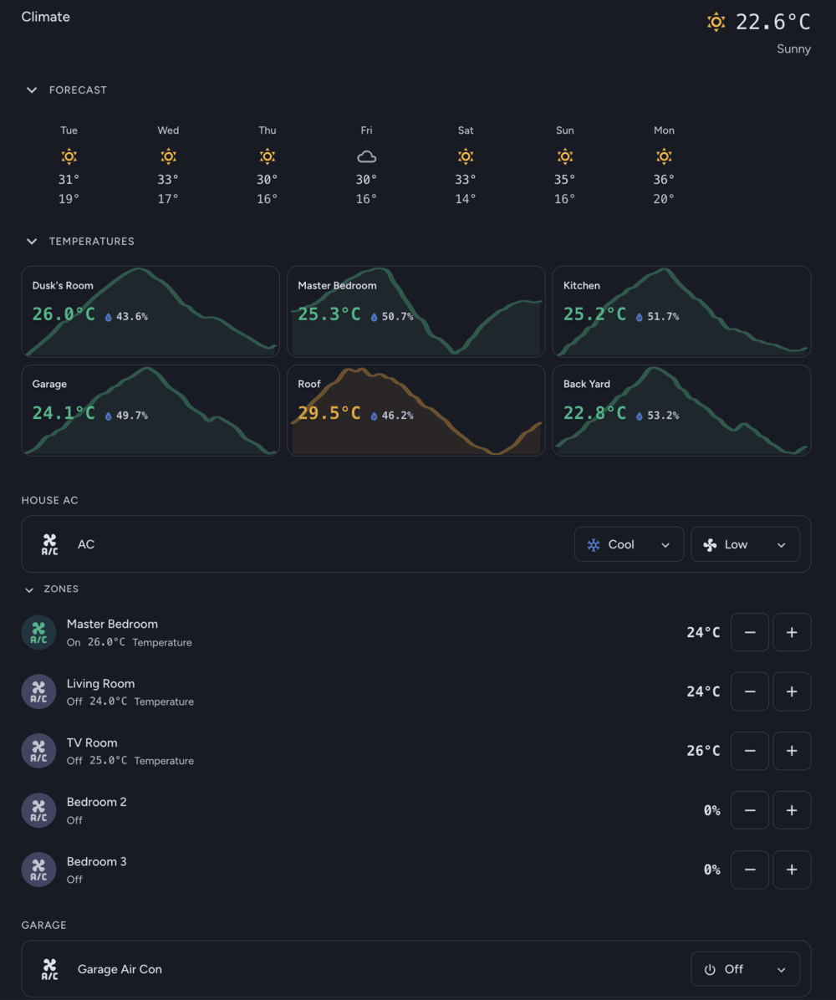

# Climate Card

[](https://github.com/hacs/integration)
[](https://github.com/bradmatt275/ha-climate-card/releases)


A unified climate monitoring and control card for Home Assistant that brings together weather forecasting, ducted AC zone control, standalone climate entities, and room temperature monitoring with historical trends.



## Features

- **Weather & Forecast** - Current conditions with temperature integrated into the forecast section
- **Temperature Sensors** - Room temperatures with 24-hour sparkline trends
- **House AC Control** - Ducted AC system with collapsible zone management
- **Climate Entities** - Standalone climate device controls
- **Fans** - Control switch-based fans with optional power monitoring
- **Section Ordering** - Customize the order of sections to your preference
- **Configurable Thresholds** - Custom temperature ranges for color coding
- **Collapsible Sections** - Focus on what matters
- **Material You Design** - Dark-first, theme-aware styling
- **Visual Editor** - Full UI configuration support

## Installation

### HACS (Recommended)

[](https://my.home-assistant.io/redirect/hacs_repository/?owner=bradmatt275&repository=ha-climate-card&category=integration)

1. Open HACS in Home Assistant
2. Go to "Frontend" section
3. Click the menu icon and select "Custom repositories"
4. Add this repository URL and select "Lovelace" as the category
5. Find "Climate Card" and install it
6. Refresh your browser

### Manual Installation

1. Download `climate-card.js` from the latest release
2. Copy it to `config/www/community/climate-card/`
3. Add the resource in your Lovelace configuration:

```yaml
resources:
  - url: /hacsfiles/climate-card/climate-card.js
    type: module
```

## Configuration

### Minimal Example

```yaml
type: custom:climate-card
weather:
  entity: weather.home
climate_entities:
  - entity: climate.living_room
```

### Full Example

```yaml
type: custom:climate-card
title: Home Climate

# Customize section order (optional)
section_order:
  - forecast
  - temperatures
  - house_ac
  - climate
  - fans

weather:
  entity: weather.home
  forecast_days: 7
  collapsible: true
  collapsed: false

temperature_sensors:
  collapsible: true
  collapsed: false
  trend_hours: 24
  columns: 3
  thresholds:
    cold: 18
    cool: 22
    comfortable: 26
    warm: 30
  sensors:
    - name: Living Room
      temperature_entity: sensor.living_room_temperature
      humidity_entity: sensor.living_room_humidity
      dewpoint_entity: sensor.living_room_dewpoint
    - name: Bedroom
      temperature_entity: sensor.bedroom_temperature
      humidity_entity: sensor.bedroom_humidity
      dewpoint_entity: sensor.bedroom_dewpoint

house_ac:
  name: AC
  icon: mdi:air-conditioner
  mode_entity: select.ac_mode
  fan_entity: select.ac_fan_speed
  zones_collapsible: true
  zones_collapsed: false
  zones:
    - name: Master Bedroom
      power_entity: switch.ac_zone_master
      temperature_entity: number.ac_zone_master_setpoint
    - name: Living Room
      power_entity: switch.ac_zone_living
      percent_open_entity: number.ac_zone_living_damper
      step: 5

climate_entities:
  - entity: climate.garage_air_con
    section_name: Garage

fans:
  section_name: FANS
  entities:
    - entity: switch.garage_fan
      name: Garage Fan
      icon: mdi:fan
      power_entity: sensor.garage_fan_power
    - entity: switch.bedroom_fan
      name: Bedroom Fan
```

## Configuration Options

### General

| Option | Type | Default | Description |
|--------|------|---------|-------------|
| `title` | string | "Climate" | Card title (only shown when no weather entity) |
| `section_order` | array | See below | Order of sections in the card |

#### Section Order

The `section_order` option allows you to customize the order sections appear in the card. The default order is:

```yaml
section_order:
  - forecast
  - temperatures
  - house_ac
  - climate
  - fans
```

You can reorder these or omit sections you don't use. This can also be configured via the visual editor.

### Weather

| Option | Type | Default | Description |
|--------|------|---------|-------------|
| `entity` | string | **Required** | Weather entity ID |
| `forecast_days` | number | 8 | Number of forecast days (1-10) |
| `show_humidity` | boolean | false | Show humidity in header |
| `collapsible` | boolean | true | Allow section to collapse |
| `collapsed` | boolean | false | Initial collapsed state |

### Temperature Sensors

| Option | Type | Default | Description |
|--------|------|---------|-------------|
| `collapsible` | boolean | true | Allow section to collapse |
| `collapsed` | boolean | false | Initial collapsed state |
| `trend_hours` | number | 24 | Hours of history for sparkline |
| `columns` | number | 3 | Grid columns (1-4) |
| `thresholds` | object | See below | Temperature color thresholds |
| `sensors` | array | **Required** | List of sensor configurations |

#### Temperature Thresholds

| Threshold | Default | Color |
|-----------|---------|-------|
| `cold` | 18 | Blue (below this) |
| `cool` | 22 | Cyan |
| `comfortable` | 26 | Green |
| `warm` | 30 | Orange (above = Red) |

#### Sensor Configuration

| Option | Type | Default | Description |
|--------|------|---------|-------------|
| `name` | string | **Required** | Display name |
| `temperature_entity` | string | **Required** | Temperature sensor entity |
| `humidity_entity` | string | - | Optional humidity sensor |
| `dewpoint_entity` | string | - | Optional dewpoint sensor |
| `icon` | string | - | Optional MDI icon |

A comfort level badge is automatically displayed when a dewpoint value is available. If a `dewpoint_entity` is configured, its value is used directly. Otherwise, when both `temperature_entity` and `humidity_entity` are available, the dewpoint is calculated automatically using the Magnus formula. The comfort scale:

| Dewpoint | Comfort Level |
|----------|---------------|
| < 10°C | Dry |
| 10–13°C | Pleasant |
| 13–16°C | Comfortable |
| 16–18°C | Slightly Humid |
| 18–21°C | Humid |
| > 21°C | Oppressive |

### House AC

| Option | Type | Default | Description |
|--------|------|---------|-------------|
| `name` | string | "AC" | Display name |
| `icon` | string | mdi:air-conditioner | Header icon |
| `power_entity` | string | - | Optional power switch |
| `mode_entity` | string | **Required** | Select entity for mode |
| `fan_entity` | string | **Required** | Select entity for fan speed |
| `zones_collapsible` | boolean | true | Allow zones to collapse |
| `zones_collapsed` | boolean | false | Initial zones collapsed state |
| `zones` | array | **Required** | List of zone configurations |

#### Zone Configuration

| Option | Type | Default | Description |
|--------|------|---------|-------------|
| `name` | string | **Required** | Zone display name |
| `power_entity` | string | - | Zone power switch entity |
| `temperature_entity` | string | - | Temperature setpoint entity |
| `percent_open_entity` | string | - | Damper percentage entity |
| `step` | number | 0.5/5 | Adjustment step |
| `icon` | string | - | Optional MDI icon |

*Note: Use either `temperature_entity` or `percent_open_entity` per zone.*

### Climate Entities

| Option | Type | Default | Description |
|--------|------|---------|-------------|
| `entity` | string | **Required** | Climate entity ID |
| `name` | string | Entity name | Display name |
| `section_name` | string | - | Section header text |
| `icon` | string | Entity icon | Override icon |
| `show_humidity` | boolean | false | Show humidity if available |

### Fans

| Option | Type | Default | Description |
|--------|------|---------|-------------|
| `section_name` | string | "FANS" | Section header text |
| `entities` | array | **Required** | List of fan configurations |

#### Fan Configuration

| Option | Type | Default | Description |
|--------|------|---------|-------------|
| `entity` | string | **Required** | Switch or fan entity ID |
| `name` | string | Entity name | Display name |
| `icon` | string | mdi:fan | Override icon |
| `power_entity` | string | - | Power sensor to show wattage |

## Development

```bash
# Install dependencies
npm install

# Build for production
npm run build

# Development with watch mode
npm run watch
```

## License

MIT License - see [LICENSE](LICENSE) for details.

## Documentation

For full documentation including customization options and CSS variables, see [docs/README.md](docs/README.md).
